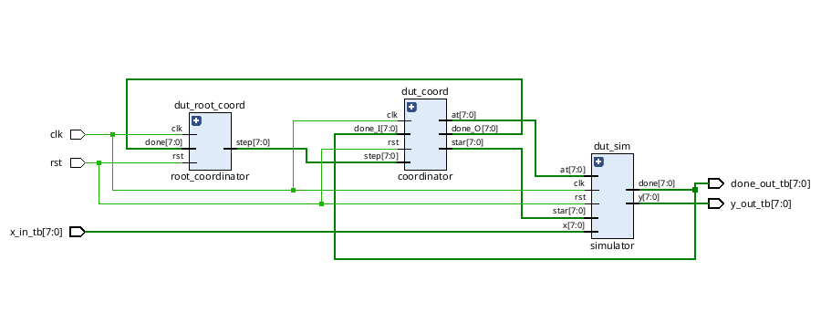
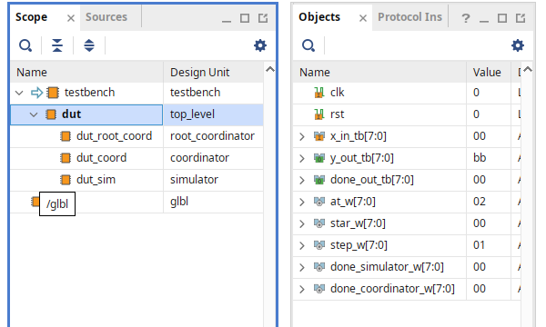

# DEVS on FPGA: Accelerating DEVS Simulation with Hardware

This repository contains the source code and design files for the **Implementation of DEVS (Discrete Event System Specification) on an FPGA**. The project explores a novel approach to DEVS simulation by leveraging the inherent parallelism and high-speed processing of Field-Programmable Gate Arrays (FPGAs).

---

## The DEVS-FPGA Relationship

The relationship between DEVS and FPGAs is a powerful and natural fit due to their fundamental structural and behavioral similarities. Both are inherently **modular and parallel** systems.

* **Direct Mapping**: A DEVS model, with its well-defined states and transitions, can be directly translated into a hardware module on the FPGA.
* **Massive Parallelism**: DEVS's native concurrency, where multiple events can occur simultaneously, aligns perfectly with the massive parallel architecture of an FPGA. This enables the transformation of a traditional sequential software simulation into a hardware-level concurrent execution.

### Why Implement DEVS on an FPGA?

Implementing DEVS on an FPGA provides significant advantages over a software-based approach:

* **High Speed**: FPGAs can execute many operations simultaneously, accelerating simulation times.
* **Low Latency**: Events are processed with minimal delay, making the system highly responsive.
* **Energy Efficiency**: Hardware execution consumes less power compared to the continuous processing of a CPU for the same task.
* **Scalability**: The architecture can be easily scaled to handle larger systems with a higher number of events and states.
* **Real-Time Applications**: The hardware implementation can be directly integrated with physical sensors or control systems for real-time applications, such as smart traffic management or complex sensor networks.

---

## DEVS-on-FPGA Design

A custom, modular architecture was developed to simulate DEVS behavior directly in hardware. The entire logic is encapsulated within a top-level module, composed of the following key components:

* **Simulator**: The core of the design, which emulates a single **atomic DEVS model**. It is responsible for processing input events and generating output events while managing its internal state.
* **Coordinator**: This is the "brain" of the design. It synchronizes multiple simulators, receiving "done" signals and providing the next simulation step to all connected modules.
* **Root Coordinator**: The entry point for the entire simulation. It provides the initial step signal and manages the overall simulation flow based on the final "done" signal from the main coordinator.

### Schematic

### Oganization  

### Design Validation

The entire circuit was validated using a comprehensive **testbench** to observe the system's behavior in detail. This approach allowed for thorough observation of input and output events, ensuring that the DEVS logic was correctly translated and processed in the hardware.

---

## Repository Organization

This repository is organized to provide a clear view of the project's development journey, from early experiments to the final design.

* `Experimental projects/`: Contains all the development versions created to experiment with and validate different logical approaches before arriving at the final design.
* `Final Version/`: The final, presented version of the DEVS-on-FPGA project. This represents the stable and validated design.
* `Practical Projects/`: Includes small, practical exercises created to help understand Verilog logic, the Vivado workflow, and interactions with the FPGA board.
* `Waves Behavioral Simulations/`: Stores the waveform files generated during behavioral simulations, which were used to debug and verify the design's functionality.

---

## Workflow and Requirements

This repository is used solely for **version control and code documentation**. While you can browse and edit the source code here, **Vivado is an essential tool** for the project's development and use.

### Why Vivado is Required

**Vivado** is a complete software suite developed by Xilinx for the synthesis and analysis of HDL (Hardware Description Language) designs. It is the only way to:
* **Synthesize** the Verilog code into a netlist (the hardware schematic).
* **Implement** the design** to place and route it on a specific FPGA device.
* **Generate a bitstream** file (.bit), which is the final configuration file used to program the FPGA.
* **Run simulations** with the built-in simulator to verify the design's behavior and validate the hardware's functionality.

### How to Install Vivado

You can download and install Vivado from the official AMD/Xilinx website.

1.  Go to the **[AMD/Xilinx Downloads page](https://www.xilinx.com/support/download.html)**.
2.  Select the **Vivado** section and choose the latest version of the "Unified Installer".
3.  Follow the installation wizard. During the process, select the **"Vivado"** product and the specific FPGA family you will be using (e.g., Artix-7, Kintex-7, etc.) to minimize the installation size.
4.  After the installation is complete, you will need a license. A free license called the **"Vivado ML Standard Edition"** is available and sufficient for most hobbyist and academic projects. You can generate this license within the Vivado License Manager.